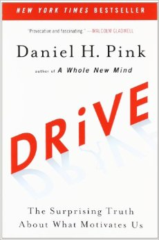
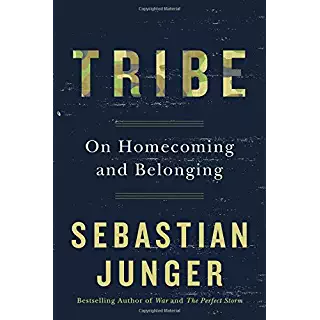

title: Kottans Story
author:
  name: Artem Sychov
  twitter: ArtemSuchov
  url: http://suchov.com
output: index.html

--
## Kottans
## Through Story
##

--

#

--

# Kottans? Community?!? Courses?!?

--

# [http://kottans.org/](http://kottans.org/)

--

## 2012:
##

--

# 2012-2013
## Первый курс
## 2 тренера
## курс по Ruby(20)
## (20)

--

# 2013-2014
## 2 курса по Ruby + расширили команду тренеров (25)
## Первый курс по JS (30)
## Первый курс по C# (25)
## (80)

--

# 2014-2015
## 2 курса по JS (30+30)
## курс по Ruby в новом составе (25)
## Java слайды
## (85)

--

# 2015-2016
## Курс по JS (Kyiv, Kharkov, Lviv)(25+25+20)
## Курс по Ruby (Kyiv, Kharkov, Lviv)(25+20+20)
## Курс по C# (Kyiv, Lviv)(25+25)
## Курс по Erlang (пробный) (20)
## (210)

--

# 2017
## Просто курс(Full-Stack) (~20)

--

# What do we have for now?

--

## About 400 alumni (KPI 300 in a year)
## Google, Amazon, eBay,  Materialize, Grummarly, RubyRiders, RailsReactor...
## Contributing to NodeSchool, RailsGirls, a ton of conferences

--

# How did we get there?
## (insider)

--

# Жесткий отбор.(тестовое)

--

# Инжинеры - инжинерам
## (люди работают с технологией)

--

# Домашек много

--

# Меняем, экспериментируем.

--

# What is the secret?

--

##
## Drive: The Surprising Truth About What Motivates Us

--

##
## Tribe: On Homecoming and Belonging

--
